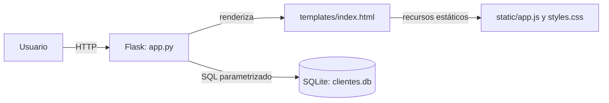

# Arquitectura

## Visión general

Nexo es una aplicación web renderizada en el servidor. Flask recibe las solicitudes, consulta o modifica una base SQLite y entrega una plantilla Jinja. JavaScript mejora la interacción del formulario; no hay una API REST separada ni un framework frontend.

La aplicación es intencionalmente pequeña: las rutas, las consultas SQL y la inicialización del esquema están en `app.py`. No existe una capa independiente de servicios o repositorios.

## Componentes

| Componente | Responsabilidad |
| --- | --- |
| `app.py` | Configura Flask y CSRF, inicializa SQLite, consulta el directorio y procesa altas, ediciones y eliminaciones. |
| `templates/index.html` | Presenta métricas, búsqueda, tabla, estados vacíos y formulario de cliente. |
| `static/app.js` | Abre y rellena el diálogo de cliente, cierra el diálogo y solicita confirmación antes de borrar. |
| `static/styles.css` | Define la presentación adaptable para escritorio y móvil. |
| `clientes.db` | Persiste los clientes en la tabla SQLite `clientes`; se crea al importar la aplicación si no existe. |
| `tests/test_app.py` | Prueba las rutas con el cliente de pruebas de Flask y bases de datos temporales. |

## Flujo de solicitudes

1. `GET /` lee el parámetro opcional `q`, consulta los indicadores y obtiene los clientes en orden alfabético. Si hay búsqueda, compara el término con nombre, empresa, correo y teléfono.
2. El servidor entrega `templates/index.html` con los resultados y tokens CSRF para los formularios de escritura.
3. `POST /clientes/guardar` valida que el nombre no esté vacío. Inserta si no se recibe un `id`; de lo contrario actualiza el registro identificado. Luego muestra un mensaje y redirige a `/`.
4. `POST /clientes/<id>/eliminar` elimina el registro indicado y redirige a `/`.

Las escrituras usan métodos HTTP POST y Flask-WTF valida CSRF antes de ejecutar la ruta. Las consultas pasan sus valores como parámetros SQL.

## Configuración y ejecución

- `DATABASE` apunta por defecto a `clientes.db`, junto a `app.py`.
- `SECRET_KEY` se lee del entorno; el valor predeterminado del código es solo para desarrollo local.
- `FLASK_DEBUG=1` activa el modo de depuración. Sin esa variable, el modo está desactivado.
- El servidor integrado de Flask es para desarrollo. En producción debe usarse un servidor WSGI y almacenamiento persistente para el archivo SQLite.

Consulta la [guía de uso](uso.md) para instalar y ejecutar la aplicación.